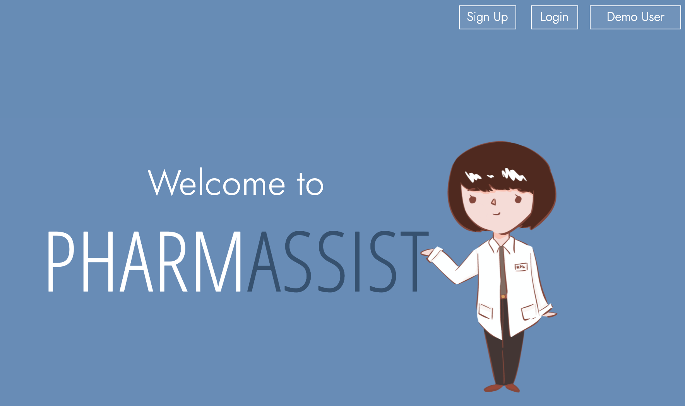
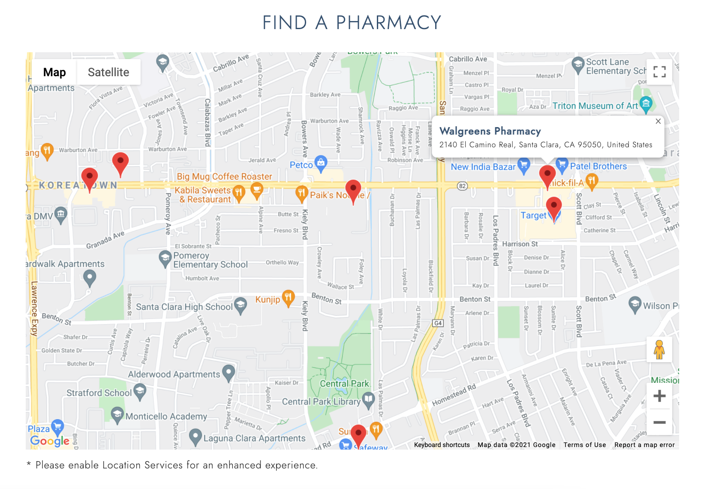

# PharmAssist

[PharmAssist Live](https://pharm4ssist.herokuapp.com/)

PharmAssist is a web application that assists users in keeping track of their medication regimen and provides useful personalized information to help increase their medication adherence.

</img>

# Technologies Used
## Core Technologies
### Backend
* Database: MongoDB
* Server-side framework: Express.js 
* Web server: Node.js
### Frontend
* Client-side framework: React/Redux

## Third Party APIs
* openFDA Drug API
* Google Maps API

# Features
## Map Locating Nearest Pharmacies
Using the Google Maps API, users will have a map that marks the pharmacies closest to their current location (if their location services are enabled).

</img>

The request to query for pharmacies is first constructed as an object.
```javascript
//frontend/src/components/map/map.js
    const request = {
        query: 'pharmacy',
        fields: ['name', 'formatted_address', 'geometry']
    };
```
The request object is passed as an argument into the built in method from the Google Maps API, `findPlaceFromQuery`. The results are then iterated over to create a marker for each query result and the user's map is centered to the first query result. 

```javascript
//frontend/src/components/map/map.js
    const service = new window.google.maps.places.PlacesService(map);
    service.textSearch(request, cb);
    
    service.findPlaceFromQuery(request, (results, status) => {
        if (status === window.google.maps.places.PlacesServiceStatus.OK && results) {
            for (let i = 0; i < results.length; i++) {
                createMarker(results[i]);
            }
            map.setCenter(results[0].geometry.location);
        }
    })
```

